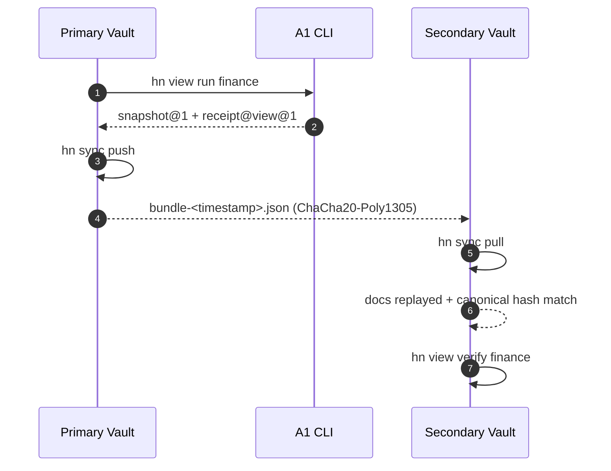

# M4 S4 – Sync & View Materialisation Walkthrough

Sprint S4 combines local view receipts with encrypted vault sync so that a
second device can trust and replay the same state. The sequence below mirrors
the flow validated by `tooling/scripts/m4-s4-test.sh`.



## CLI Quick Reference

Run this sequence on your own machines (replace paths with your vault home):

```bash
# 1. Create a view snapshot + signed receipt on the primary device.
HN_HOME=~/.human-net/alice hn view run finance

# 2. Inspect available views together with their latest receipts.
HN_HOME=~/.human-net/alice hn view list --with-receipts

# 3. Push an encrypted bundle for every paired device.
HN_HOME=~/.human-net/alice hn sync push

# 4. Copy the emitted bundle into the secondary inbox (or deliver out-of-band),
#    then apply it.
cp ~/.human-net/alice/nodes/alice/sync/<pair-id>/outbox/bundle-*.json \
   ~/.human-net/bob/nodes/bob/sync/<pair-id>/inbox/
HN_HOME=~/.human-net/bob hn sync pull

# 5. Check current sync status from either side.
HN_HOME=~/.human-net/alice hn sync status

# 6. Verify that the replicated view still matches the stored receipt.
HN_HOME=~/.human-net/bob hn view verify finance
```

The receipt signature ensures the secondary vault can prove that the snapshot
originated from Alice’s DID, while `hn sync status` reports queue depth and
recent activity (last push, pull, and observed remote head).
